# Unity Game Build SOP (UnityPlay / itch.io)

## Prerequisites

- Unity 2022.3.x (LTS) installed via Unity Hub
- Build module installed for your target platform:
  - **WebGL**: `WebGL Build Support` (strongly recommended: browser-based, zero install for players)
  - If missing: Unity Hub > Installs > your version > Add Modules

> **CRITICAL PATH WARNING:** Your entire Unity project **MUST** be in an **English-only** file path (e.g., `C:\UnityProjects\MyGame`). If your Windows username or any folder contains Chinese/non-English characters (e.g., `C:\Users\陳小明\桌面`), **WebGL compilation WILL FAIL** with cryptic C++ errors. Move the project to a safe path before building.

---

## Step 1: Verify Scene & Settings

### 1.1 Check Scenes in Build

1. Open Unity menu: **File > Build Settings** (shortcut: `Ctrl+Shift+B` / `Cmd+Shift+B`)
2. Check **Scenes In Build** list
3. Confirm your main scene is listed and checkbox is checked
4. If the list is empty:
   - Click **Add Open Scenes** (make sure your main scene is open)
   - It should appear with index 0

> **Common mistake:** If you see multiple scenes listed, make sure your main scene is index 0 (the first scene that loads). Drag to reorder if needed.

### 1.2 Force Windowed Mode (Prevents Fullscreen Panic)

1. In Build Settings, click **Player Settings** (bottom-left)
2. Select **Player** > expand **Resolution and Presentation**
3. Set **Fullscreen Mode** to **Windowed**
4. Default Screen Width: `1280`, Height: `720`

---

## Step 2: Choose Your Build Strategy

1. In Build Settings, select **WebGL** and click **Switch Platform** (wait 1-2 min), If you don't have WebGL module, press Install WebGL to install it, *restart Unity Editor after installation completed.*
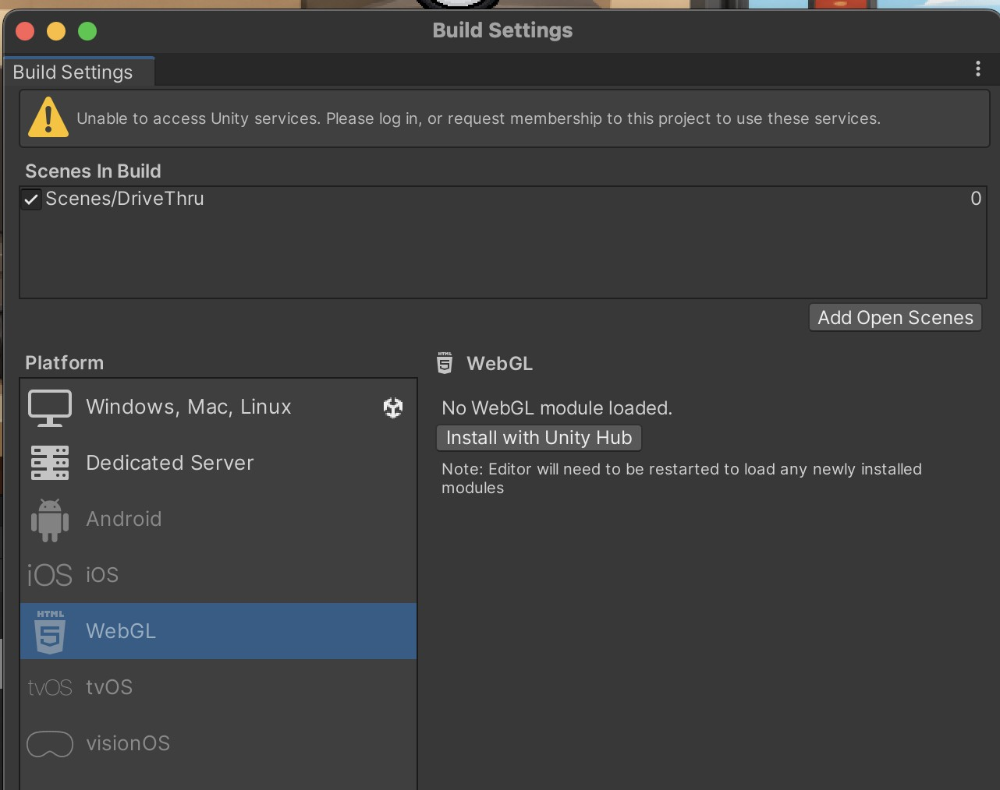
2. It require 2.55 GB disk space after installation completed in Windows platform.
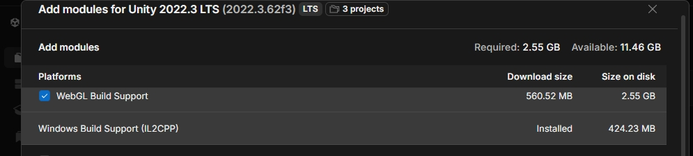

### Option A: WebGL Unity Play(Recommended)
Prerequisites: An unity account (You should already have it)
1. Go to Windows-> Package Manager, Choose Categort to Unity Regostry
 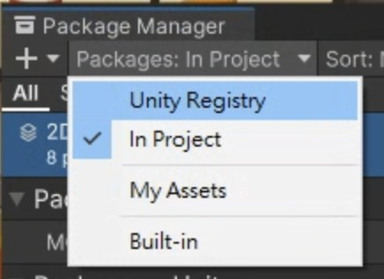
2. Input "WebGL Publisher" in search bar and Install WebGL Publisher
   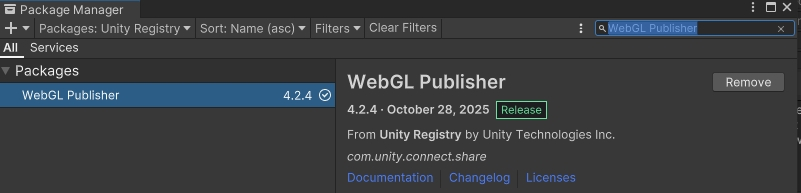
3. You can see the menu "Publish" is appeared. Choose "WebGL Project"
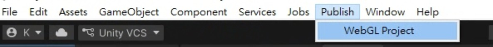
4. You should see empty WebGL project dialog when you open is at first time, choose "Build and Publish"
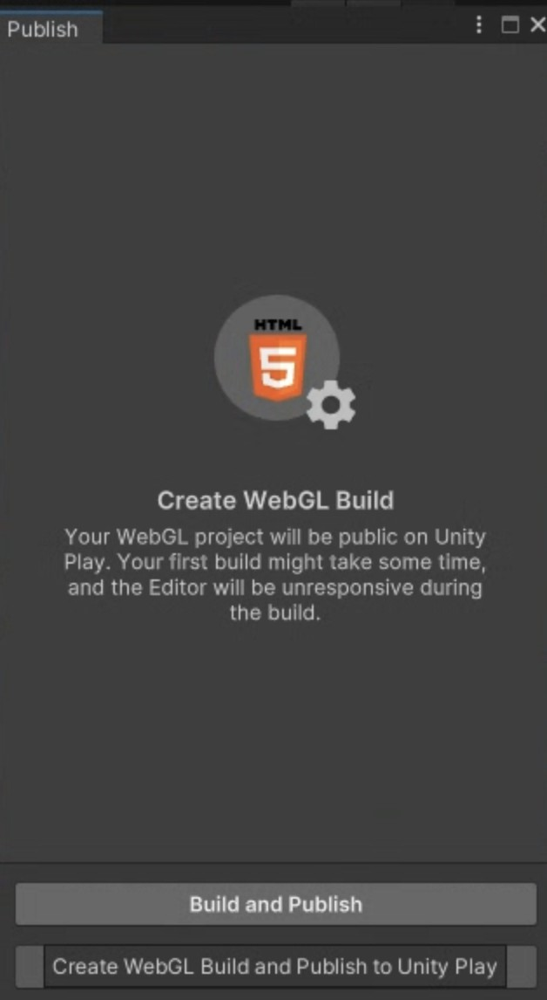
5. **If you see this prompt windows apprear, choose "Switch to WebGL" **
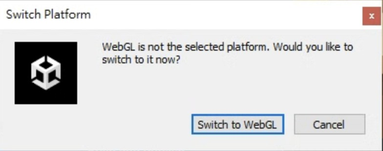
6. Press "Build and Publish" button, choose You WebGLBuild folder, you can press "Select Folder" button to create a new folder directly
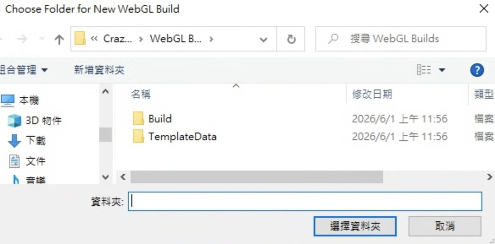
7. After build and upload webGL package complete, you will be led to publish web page on browser, please fill the Column "Title" and "Description. Choose the publish setting to "Unlisted" from "Public"
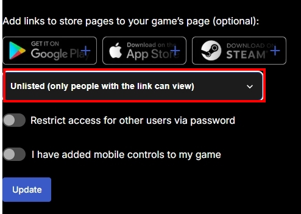
8. Press "Save" to complete the publish process, then share the URL of your game to Classroom
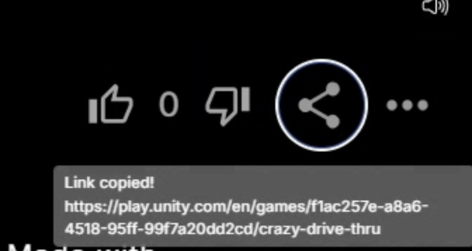

### Option B: itch.io

1. Go to File -> Build Settings, choose WebGL platform to build
!WebGL03](img/WebGL03.jpg)
2. Click **Build**, choose the folder to build, usually "Build" folder
3. Wait for compilation (~3-5 minutes, longer than local builds), Output: a folder containing `index.html`
> **DO NOT** double-click `index.html` to test! Web browsers block local file execution (CORS policy). You **MUST** upload to Unity Play, or use **"Build And Run"** in Unity (which spins up a temporary local server).

> **First-time WebGL build warning:** The first WebGL build may take **15-30 minutes** on a standard laptop. DO NOT force close Unity. Be patient.

4. After build complete, open windows file explorer: <Your project folder>\Build, Zip the **contents** of the `Builds_WebGL` folder (make sure `index.html` is inside the zip root)
!WebGL04](img/WebGL04.jpg)
5. Go to https://itch.io/ to register account
7. Choose "Upload a game" to upload your game project
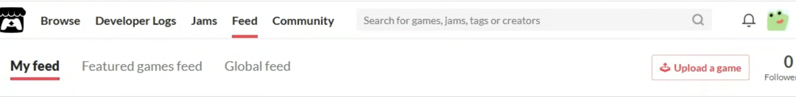
8. If you have no other game project, choose "Create new project"
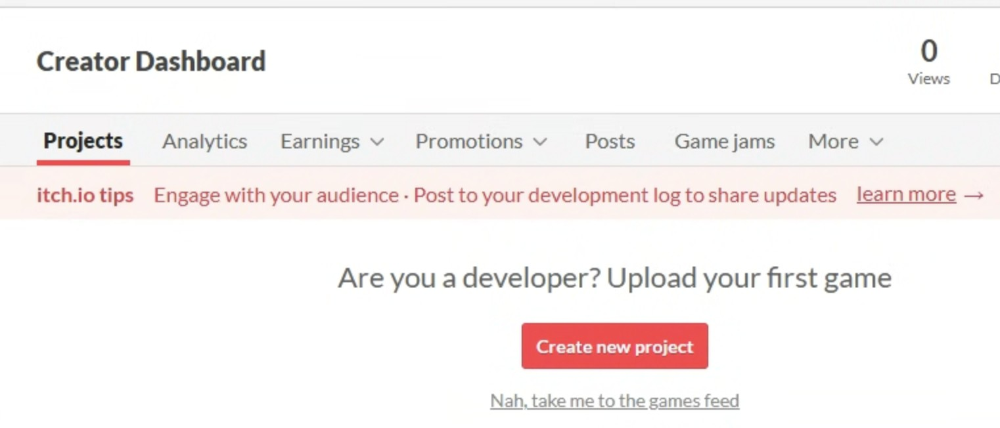
9. In "Kind of project", choose **HTML**
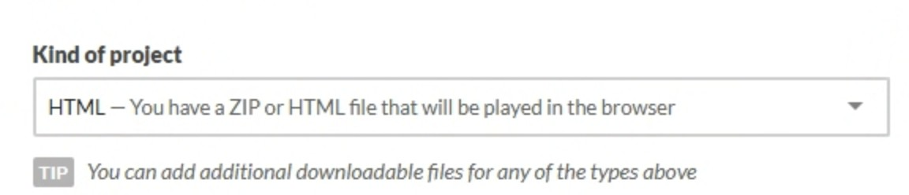
10. In "Uploads", choose **Your zipped file** to upload the
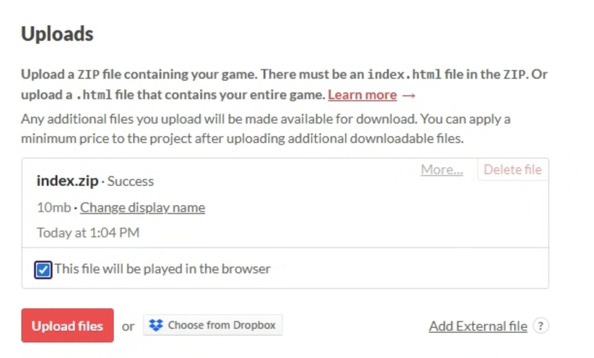
11. In "Embed Options", set the resolutions of your game design, for example, "1280 x 720"
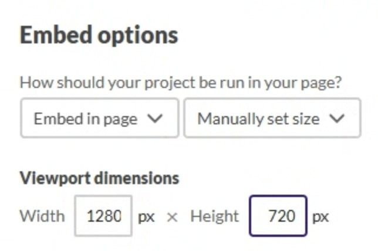
12. In "Visibility & access", choose **Public** and **Unlisted in search & browse** (Unless your team would share the game everyone in Internet)
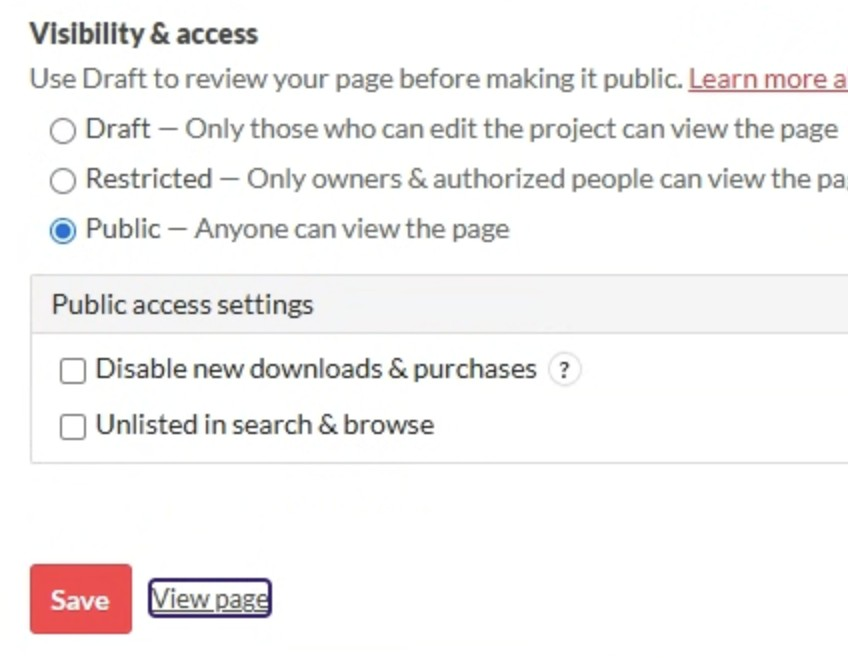
13. Press "Save" button to complete the game publish
14. Share your game project to complete, for example: https://kunio666666.itch.io/crazy-drive-thru
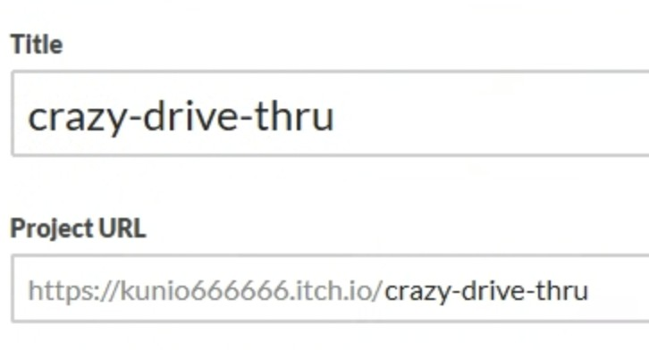
---

## Troubleshooting

### Build fails with "No scenes in build"
- File > Build Settings > Add Open Scenes

### Build fails with compilation errors
- Check Console window (Window > General > Console)
- Fix all red errors before building
- Yellow warnings are usually OK

### Game runs but screen is black
- Your main scene might not be index 0 in Build Settings
- Or essential prefabs/objects are missing from the scene

### Windows: clicking .exe causes black screen / instant crash
- **Unzip trap!** You must NOT double-click the .exe inside the zip preview window
- Right-click the .zip > "Extract All..." > open the extracted folder > then run the .exe

### Windows Defender blocks the game
- This is normal for unsigned executables
- Click "More info" > "Run anyway"
- Or add the folder to Windows Defender exclusions

### Mac blocks the app ("unidentified developer")
- Right-click the .app > Open > Click "Open" in dialog
- This only needs to be done once

### Mac shows "file is damaged, move to trash"
- This is macOS Gatekeeper quarantine, not actual file corruption
- **Fix:**
  1. Open **Terminal** (`Cmd + Space`, search "Terminal")
  2. Type `xattr -cr ` (note: there must be a space after `cr`)
  3. **Drag** the .app file from Finder into the Terminal window
  4. Press Enter
  5. Double-click the app again — it will now open

### Build is very large (> 200MB)
- File > Build Settings > Player Settings > Other Settings
- Set **Managed Stripping Level** to "Medium" or "High"
- Uncheck **Development Build** if it's checked

### WebGL: Color Space error during build
- Player Settings > Other Settings > set **Color Space** from `Linear` to `Gamma`

### WebGL: game crashes in browser (Out of Memory)
- Your images or audio files are too large
- Select images in Project window > Inspector > reduce **Max Size** to `1024`
- Select audio files > Inspector > set **Load Type** to `Compressed in Memory`
- Rebuild

| Output (WebGL) | folder with `index.html` → zip → upload to Unity Play |
| Recommended resolution | 1280 x 720, Windowed mode |
